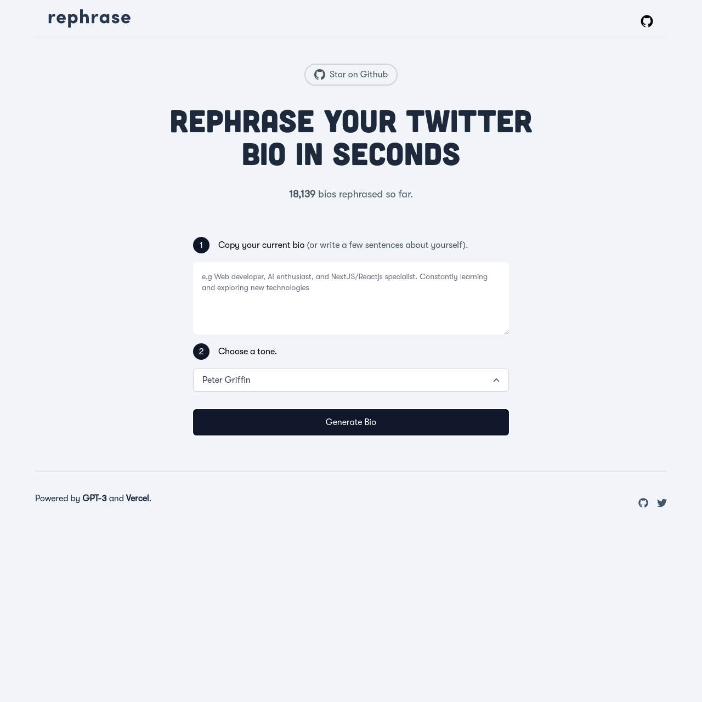

# [RephraseAI](https://www.rephrase.vercel.app/)
<p>This Project Rephrases your Twitter Bio using AI</p>

[](https://www.rephrase.vercel.app)

## Running Locally

After cloning the repo, go to [OpenAI](https://beta.openai.com/account/api-keys) to make an account and put your API key in a file called `.env`.

Then, run the application in the command line and it will be available at `http://localhost:3000`.

```bash
npm run dev
```


<p>Powered by <b>NextJS</b> and <b> GPT-3</b>.</p>
<p>Inspired by <a href="https://github.com/Nutlope">Nutlope</a></p>
